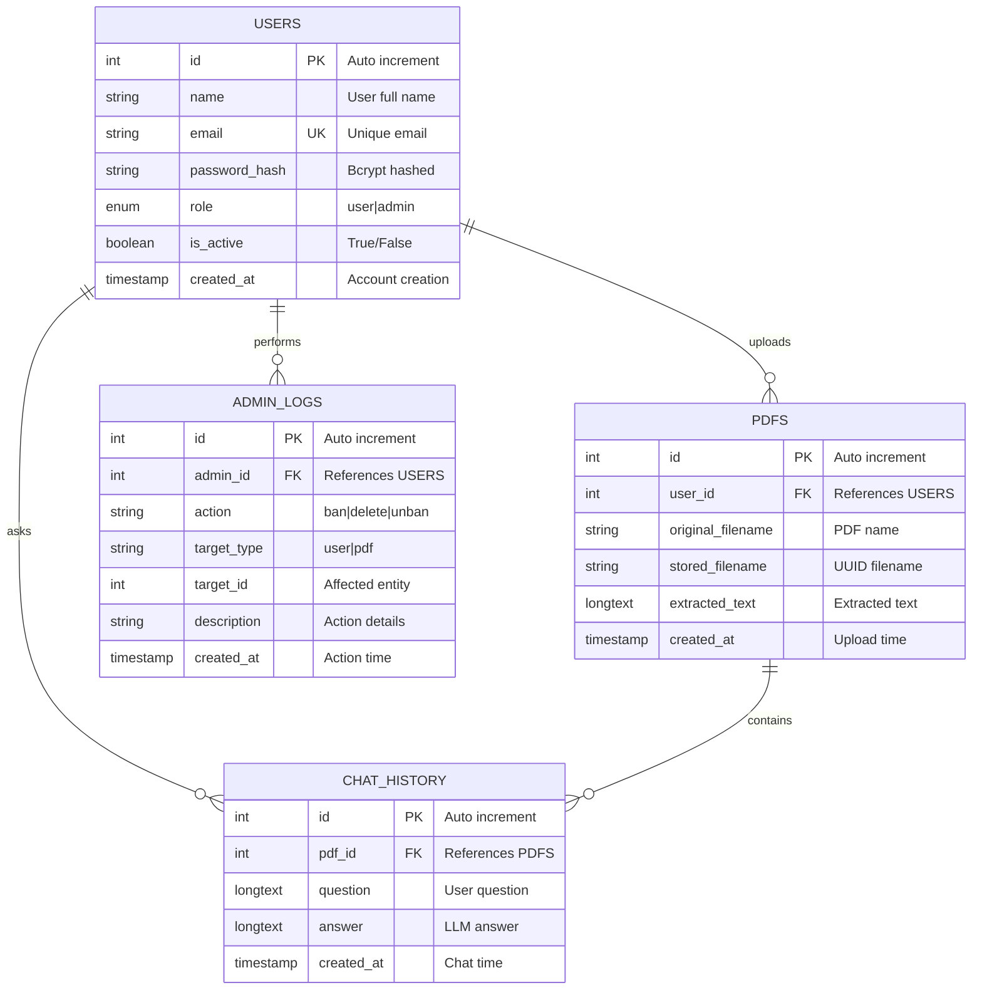
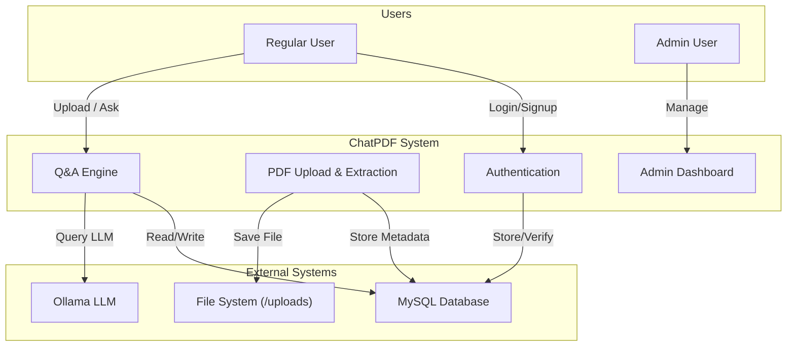
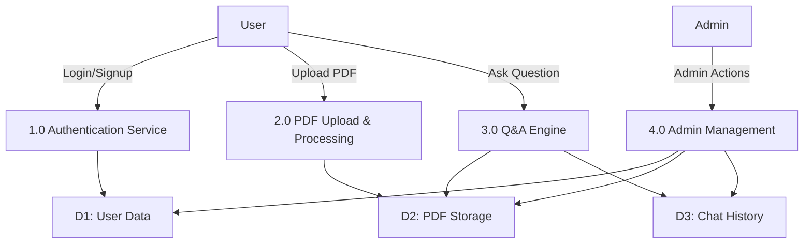
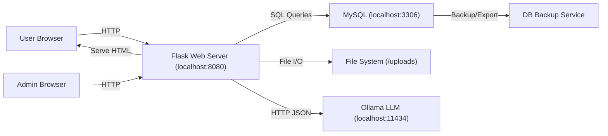
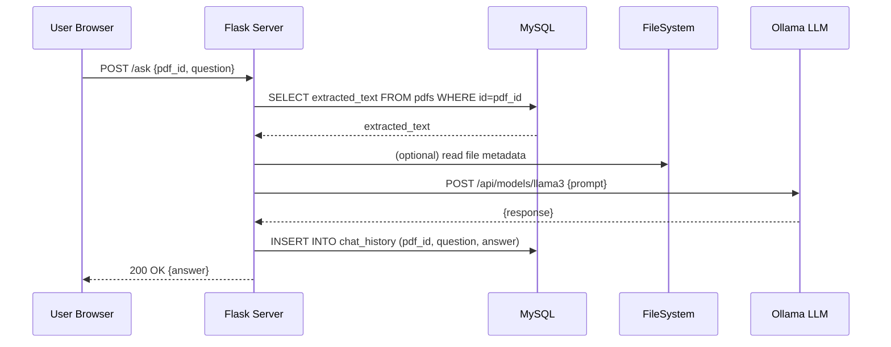

# CHATPDF: AI-POWERED DOCUMENT QUESTION ANSWERING SYSTEM

## TABLE OF CONTENTS

CHAPTER 1: INTRODUCTION .................................................................... 1
1.1 Introduction ............................................................................................................ 1
1.2 Problem Statement .................................................................................................. 2
1.3 Objectives ............................................................................................................... 2
1.4 Scope and Limitation .............................................................................................. 3
1.5 Development Methodology .................................................................................... 4
1.6 Report Organization ................................................................................................... 6

CHAPTER 2: BACKGROUND STUDY AND LITERATURE REVIEW ... 7
2.1 Background Study ...................................................................................................... 7
2.2 Literature Review ....................................................................................................... 8

CHAPTER 3: SYSTEM ANALYSIS AND DESIGN .................................. 10
3.1 System Analysis ....................................................................................................... 10
3.1.1 Requirement Analysis .................................................................................... 10
3.1.2 Feasibility Analysis ........................................................................................ 12
3.1.3 Data Modeling ............................................................................................... 13
3.1.4 Process Modelling: Data Flow Diagram (DFD) ............................................ 14
3.2 System Design ...................................................................................................... 16
3.2.1 Architectural Design ...................................................................................... 16
3.2.2 Database Schema Design ............................................................................... 18
3.2.3 Interface Design (UI/ Interface Structure Design) ......................................... 19
3.2.4 Physical DFD ................................................................................................. 31
3.3 Algorithm Details ................................................................................................. 32

CHAPTER 4: IMPLEMENTATION AND TESTING ................................. 33
4.1 Implementation ......................................................................................................... 33
4.1.1 Tools Used.......................................................................................................... 33
4.1.2 Implementation Details of Modules ................................................................... 34
4.2 Testing ...................................................................................................................... 37
4.2.1 Test Cases for Unit Testing ................................................................................ 37
4.2.2 Test Cases for System Testing ........................................................................... 43

CHAPTER 5: CONCLUSION AND FUTURE RECOMMENDATIONS .. 48
5.1 Lesson Learnt ........................................................................................................... 48
5.2 Conclusion ................................................................................................................ 48
5.3 Future Recommendations ......................................................................................... 48

REFERENCE ................................................................................................. 49
APPENDIX .................................................................................................... 50

---

# CHAPTER 1: INTRODUCTION

## 1.1 Introduction

The ChatPDF system is an innovative artificial intelligence-powered web application that enables users to upload PDF documents and engage in natural language conversations about their content. The system leverages advanced language models and intelligent document processing techniques to extract valuable insights from PDF documents without requiring manual reading or summarization. This application represents a convergence of multiple technologies including web frameworks, databases, machine learning inference engines, and secure authentication mechanisms. The primary goal of the ChatPDF system is to provide users with an intuitive and efficient method to interact with PDF documents through conversational artificial intelligence, thereby improving productivity and information accessibility. The system incorporates a comprehensive administrative module that allows system administrators to monitor user activities, manage user accounts, oversee document storage, and maintain system integrity through audit logging and security controls. By combining Flask web framework, MySQL database management system, Ollama language models, and PyPDF2 document processing capabilities, the ChatPDF system demonstrates a practical implementation of modern web development practices integrated with artificial intelligence technology.

## 1.2 Problem Statement

In the contemporary digital landscape, users often encounter challenges when attempting to extract specific information from PDF documents. Traditional methods of document analysis require extensive manual reading, which is time-consuming and inefficient. Organizations and individuals frequently struggle with the following limitations: (1) Difficulty in quickly locating relevant information within large PDF documents, (2) Lack of interactive mechanisms to ask specific questions about document content, (3) Absence of centralized systems to manage multiple documents and their associated queries, (4) Missing administrative controls for monitoring system usage and maintaining security, and (5) Inability to leverage artificial intelligence technology to provide intelligent responses about document content. The ChatPDF system addresses these problems by providing an automated, intelligent, and user-friendly solution for document interaction and information retrieval through conversational artificial intelligence.

## 1.3 Objectives

The primary objectives of the ChatPDF system development are as follows:

1. To design and implement a web-based platform that enables users to upload PDF documents and extract text content efficiently using automated document processing techniques.

2. To integrate artificial intelligence language models that can comprehend PDF content and provide accurate, contextual responses to user queries about document information.

3. To develop a secure authentication and authorization system that protects user privacy through password encryption and implements role-based access control mechanisms.

4. To create a comprehensive administrative module that provides system administrators with tools for user management, document oversight, audit logging, and system monitoring.

5. To implement a scalable database architecture that efficiently stores user information, PDF metadata, extracted text content, chat history, and administrative audit logs.

6. To provide an intuitive user interface that enables both regular users and administrators to interact with the system effectively and efficiently.

7. To ensure system reliability, security, and performance through comprehensive testing, error handling, and optimization techniques.

## 1.4 Scope and Limitation

### Scope

The ChatPDF system encompasses the following functional components and features:

- User authentication and authorization mechanisms including signup, login, and logout functionality
- PDF document upload and processing with automatic text extraction capabilities
- Interactive question-answering interface utilizing local artificial intelligence models
- Chat history management and persistent storage of user interactions
- Administrative dashboard for user and document management
- User activity monitoring and audit logging for administrative purposes
- Role-based access control distinguishing between regular users and administrative accounts
- Storage management for uploaded PDF documents and their metadata

### Limitations

The ChatPDF system operates within the following constraints:

1. The system requires Ollama language model inference engine to be installed and running locally on the server, limiting deployment flexibility to environments with sufficient computational resources.

2. PDF text extraction is limited to text-based PDFs and does not support scanned image-based PDFs without additional optical character recognition implementation.

3. The context window for language model queries is limited to 10,000 characters, which may restrict the system's ability to analyze very large documents in a single query.

4. The current implementation uses only the llama3 model; switching models requires manual code modifications and system restart.

5. The system is designed for single-server deployment and does not currently implement horizontal scaling or load balancing mechanisms.

6. File storage is limited to the local file system; cloud storage integration is not implemented in the current version.

7. The system does not implement advanced features such as document versioning, collaborative features, or role-based PDF access controls.

8. Language model response time is dependent on system computational resources and may be slow for devices with limited processing capabilities.

## 1.5 Development Methodology

The ChatPDF system development follows an Agile/Iterative Spiral methodology, which combines the advantages of both agile rapid development and spiral risk management approaches. This methodology is particularly suitable for projects involving emerging technologies such as artificial intelligence integration.

### Development Phases

**Phase 1: Planning and Requirements Analysis**
During this phase, system requirements were gathered and analyzed through stakeholder discussions, technical feasibility studies, and requirements documentation. The team identified functional requirements including user authentication, document upload, Q&A processing, and administrative controls, as well as non-functional requirements such as security, scalability, and performance.

**Phase 2: Design and Architecture**
The design phase involved creating system architecture, database schemas, data flow diagrams, and interface mockups. System design decisions were made regarding technology selection, including Flask for web framework, MySQL for database, and Ollama for language model inference. Entity-relationship diagrams were designed to model the complex relationships between users, documents, chat history, and administrative logs.

**Phase 3: Iterative Development (Spiral Cycles)**

*Cycle 1: MVP Development*
The first development cycle focused on implementing the minimum viable product with core functionality including user authentication, PDF upload, text extraction, and basic Q&A capabilities. This cycle established the foundational architecture and demonstrated proof of concept.

*Cycle 2: Admin Module Enhancement*
The second cycle expanded the system with comprehensive administrative functionality including user management, document management, audit logging, and role-based access control. Risk mitigation strategies were implemented including enhanced security measures and error handling.

*Cycle 3: Polish and Optimization*
The third cycle focused on refinement, optimization, testing, and bug fixes. Security vulnerabilities related to password hashing were identified and resolved. The system was optimized for performance and reliability.

**Phase 4: Testing and Quality Assurance**
Comprehensive testing strategies were implemented including unit testing, integration testing, system testing, and security testing. Test cases were developed for all critical functionality including authentication flows, PDF processing, Q&A generation, and administrative operations.

**Phase 5: Deployment and Documentation**
The finalized system was deployed to the development environment. Comprehensive technical documentation was prepared including user manuals, administrator guides, and technical specifications.

### Iterative Risk Management

The spiral model approach allowed for continuous risk identification and mitigation. Key risks identified and addressed included:
- Security vulnerabilities in authentication mechanisms (addressed through proper bcrypt implementation)
- Database integrity concerns (addressed through foreign key constraints and cascading deletes)
- Integration challenges with Ollama LLM (addressed through proper error handling and timeouts)
- Scalability concerns (addressed through efficient database indexing)

## 1.6 Report Organization

This technical report is organized into five comprehensive chapters that systematically document the ChatPDF system development:

Chapter 1 provides an introduction to the project, including problem statement, objectives, scope, limitations, development methodology, and overall organization of the report.

Chapter 2 presents background study information about relevant technologies, concepts, and existing solutions in the field of document processing and artificial intelligence, along with a comprehensive literature review of related systems and technologies.

Chapter 3 details system analysis and design processes, including requirement analysis, feasibility studies, data modeling with entity-relationship diagrams, process modeling using data flow diagrams, architectural design, database schema design, user interface design specifications, and algorithm details.

Chapter 4 covers implementation and testing aspects, detailing tools used in development, implementation details of individual modules, unit testing procedures, and system testing approaches with comprehensive test cases.

Chapter 5 concludes the report with lessons learned during development, overall conclusions about system achievements, and recommendations for future enhancements and improvements.

---

# CHAPTER 2: BACKGROUND STUDY AND LITERATURE REVIEW

## 2.1 Background Study

### Evolution of Document Processing Systems

Document processing has evolved significantly over the past two decades, transitioning from manual methods to automated systems. Early document management systems primarily focused on storage and retrieval mechanisms without intelligent analysis capabilities. The emergence of optical character recognition technology enabled conversion of scanned documents to digital text. Contemporary systems increasingly incorporate artificial intelligence and natural language processing to provide sophisticated document analysis and information extraction capabilities.

### Artificial Intelligence in Document Analysis

Recent advances in large language models have revolutionized document understanding and information extraction. Models such as GPT, BERT, and LLaMA have demonstrated remarkable capabilities in comprehending and reasoning about textual content. These models, when properly integrated into applications, can provide users with intelligent responses to questions about document content. The availability of open-source language models like LLaMA through inference engines such as Ollama has democratized access to powerful AI capabilities, enabling organizations to deploy local AI solutions without reliance on expensive cloud-based APIs.

### Web Application Architecture

Modern web applications typically employ a three-tier architecture consisting of presentation layer, business logic layer, and data persistence layer. Flask, a lightweight Python web framework, provides an excellent foundation for building scalable web applications. When combined with scalable databases like MySQL and proper architectural patterns, Flask enables development of robust applications suitable for production environments.

### Document Upload and Storage Systems

Secure document upload and storage present both technical and security challenges. Best practices in this area include storing files in secure directories with restricted permissions, generating unique file identifiers to prevent naming conflicts, implementing virus scanning for uploaded files, and validating file types before storage. The ChatPDF system implements many of these practices.

### Authentication and Authorization in Web Applications

Secure authentication is fundamental to protecting user data and system integrity. Modern authentication approaches employ password hashing algorithms such as bcrypt that employ salt and multiple iterations to resist brute-force attacks. Role-based access control provides fine-grained permission management by assigning users to roles with specific privileges.

## 2.2 Literature Review

### Related Systems and Technologies

**Document Question Answering Systems**: Recent research in document question answering has produced systems capable of extracting precise answers from documents given natural language queries. Techniques include passage retrieval, machine comprehension, and generative approaches. The ChatPDF system employs a generative approach where the language model synthesizes answers based on document context.

**Language Models and Inference Engines**: Large language models like GPT-3, GPT-4, and LLaMA have demonstrated exceptional capabilities in natural language understanding and generation. Ollama provides an efficient inference engine for running these models locally, offering advantages in privacy, latency, and cost compared to cloud-based APIs.

**Web Framework Comparison**: Flask provides a lightweight, flexible foundation for web applications, though it requires more manual implementation compared to full-stack frameworks. Django offers more built-in functionality but with increased complexity. For the ChatPDF system, Flask's simplicity and flexibility proved advantageous.

**Database Technologies**: MySQL provides reliable, scalable relational database capabilities suitable for ChatPDF's structured data requirements. Alternative NoSQL databases like MongoDB could provide flexibility for unstructured data but would complicate transactional integrity.

**Security in Web Applications**: Industry standards emphasize defense in depth, implementing multiple security layers including input validation, parameterized queries, secure password storage, HTTPS encryption, and access control. The ChatPDF system implements many of these principles.

**PDF Processing Libraries**: PyPDF2 provides straightforward PDF text extraction capabilities suitable for ChatPDF. Alternative libraries like pdfplumber offer more sophisticated extraction but with increased complexity. PyPDF2 was selected for its balance of functionality and simplicity.

### Comparative Analysis of Similar Systems

Existing document analysis systems fall into several categories: (1) Commercial cloud-based solutions offering comprehensive feature sets but with privacy concerns and ongoing costs, (2) Enterprise document management systems providing sophisticated workflows but requiring significant infrastructure investment, (3) Open-source solutions offering flexibility but requiring technical expertise for deployment and maintenance.

The ChatPDF system occupies a unique position by providing a specialized solution focused specifically on document question answering with integrated administrative controls and local deployment capabilities that address privacy concerns.

### Research Findings

Literature review reveals that effective document question answering systems typically require: (1) Accurate text extraction from documents, (2) Efficient context retrieval for relevant document sections, (3) Advanced language models capable of complex reasoning, (4) Proper error handling for edge cases, and (5) User-friendly interfaces enabling non-technical users to benefit from advanced capabilities.

The ChatPDF system architecture reflects these research findings by implementing all identified critical components.

---

# CHAPTER 3: SYSTEM ANALYSIS AND DESIGN

## 3.1 System Analysis

### 3.1.1 Requirement Analysis

**Functional Requirements**

The ChatPDF system must fulfill the following functional requirements:

1. **User Account Management**: The system shall support user registration with email and password, user login with credential validation, user logout with session termination, and password encryption using bcrypt hashing algorithms.

2. **Document Management**: The system shall enable users to upload PDF documents, automatically extract text content from PDF files, store document metadata including original filename and storage location, and manage document storage with efficient retrieval capabilities.

3. **Question Answering Interface**: The system shall allow users to submit natural language questions about uploaded documents, retrieve relevant document context, query the language model with contextual prompts, and display generated responses to users.

4. **Chat History Management**: The system shall maintain persistent storage of all questions asked by users, store corresponding artificial intelligence generated responses, enable users to view historical interactions, and support efficient retrieval of chat history.

5. **Administrative Functions**: The system shall provide administrators with user management capabilities including viewing user lists, banning users from system access, deleting user accounts and associated data, viewing document inventories, deleting documents and associated chat history, monitoring system statistics, and accessing audit logs of administrative actions.

6. **Security and Authorization**: The system shall implement role-based access control distinguishing between regular users and administrators, enforce authentication requirements for protected resources, validate user permissions before granting access to administrative functions, and maintain audit logs of administrative actions.

**Non-Functional Requirements**

The following non-functional requirements define system quality attributes:

1. **Performance**: The system shall respond to user requests within reasonable timeframes, with document upload and processing completing within 30 seconds, Q&A generation responding within 120 seconds, and administrative queries completing within 5 seconds.

2. **Scalability**: The system shall support concurrent user access without performance degradation, implement efficient database indexing to support queries on large datasets, and provide administrative monitoring of system resource utilization.

3. **Reliability**: The system shall maintain 99% availability during normal operation, gracefully handle errors without system crashes, provide informative error messages to users, and maintain data integrity through proper transaction management.

4. **Security**: The system shall employ secure password storage using bcrypt hashing, prevent SQL injection attacks through parameterized queries, protect user sessions through proper session management, and maintain audit logs of administrative actions.

5. **Usability**: The system shall provide intuitive user interfaces requiring minimal training, display clear error messages when operations fail, organize administrative interfaces logically, and support common browsers.

6. **Maintainability**: The system shall implement modular code architecture enabling easy maintenance and updates, include comprehensive documentation and code comments, employ standard design patterns, and maintain separation of concerns.

### 3.1.2 Feasibility Analysis

**Technical Feasibility**

The proposed system architecture is technically feasible using existing open-source technologies. Flask web framework is mature and well-documented, supporting rapid development. MySQL database is reliable and widely deployed. Ollama with LLaMA models provides accessible artificial intelligence capabilities. PyPDF2 successfully handles PDF document processing. Python language offers rich libraries for all required functionality. The team possesses necessary technical expertise for implementation.

**Economic Feasibility**

The system employs entirely open-source and freely available technologies, eliminating licensing costs. Infrastructure requirements are minimal, requiring only a standard server with adequate processing power and storage capacity. Development costs are limited to human resources. Operational costs are minimal, consisting primarily of server hosting and maintenance. The system demonstrates positive economic viability with minimal capital investment.

**Operational Feasibility**

The system architecture supports standard operational procedures including system deployment, backup and recovery, user management, and monitoring. Administrative interfaces provide necessary operational controls. Deployment procedures are straightforward, requiring only Flask application launch and MySQL initialization. The system integrates with standard deployment environments and development practices.

**Schedule Feasibility**

The project timeline is realistic and achievable. Core functionality development requires approximately 4-6 weeks, administrative module implementation requires 2-3 weeks, testing and refinement require 2-3 weeks, and documentation requires 1-2 weeks. Total project duration of approximately 10-14 weeks is reasonable for the scope of functionality.

### 3.1.3 Data Modeling

**Entity-Relationship Diagram**

The ChatPDF system implements four primary entities with specific relationships:

```
USERS (1) -------- uploads -------- (Many) PDFS
  |id (PK)                             |id (PK)
  |name                                |user_id (FK)
  |email (UK)                          |original_filename
  |password_hash                       |stored_filename
  |role                                |extracted_text
  |is_active                           |created_at
  |created_at

USERS (1) -------- asks -------- (Many) CHAT_HISTORY
                                  |id (PK)
                                  |pdf_id (FK)
                                  |question
                                  |answer
                                  |created_at

PDFS (1) -------- contains -------- (Many) CHAT_HISTORY

USERS (1) -------- performs -------- (Many) ADMIN_LOGS
                                      |id (PK)
                                      |admin_id (FK)
                                      |action
                                      |target_type
                                      |target_id
                                      |created_at
```

**Entity Descriptions**

The USERS entity stores user account information including unique identification, authentication credentials, role designation, and account status. The PDFS entity maintains document metadata and extracted text content. The CHAT_HISTORY entity records all user interactions including questions and generated responses. The ADMIN_LOGS entity maintains audit trail of administrative actions.

### ER Diagram



### 3.1.4 Process Modelling: Data Flow Diagram (DFD)

**Level 0 Context Diagram**

The Level 0 context diagram illustrates the system boundary and external entities interacting with the ChatPDF system:

External Entities:
- Users (regular system users)
- Administrators (system administrators)
- Ollama LLM (external intelligence service)

Processes:
- ChatPDF System (integrated whole system)

Data Stores:
- All data persistence mechanisms (combined)

**Level 1 Data Flow Diagram**

The Level 1 DFD decomposes the system into four primary processes:

1. **Authentication Service (Process 1.0)**: Handles user login, signup, and credential verification. Interacts with user data store to store and retrieve credentials.

2. **PDF Upload & Processing (Process 2.0)**: Accepts PDF uploads, performs text extraction using PyPDF2, stores documents in file system, and maintains metadata in database.

3. **Q&A Engine (Process 3.0)**: Processes user questions, retrieves relevant document context, constructs prompts, queries Ollama language model, and stores interactions in database.

4. **Admin Management (Process 4.0)**: Provides user management functions including ban/delete operations, PDF management, system monitoring, and audit logging.

### Context Diagram (Mermaid)



### DFD Level 1 (Mermaid)



## 3.2 System Design

### 3.2.1 Architectural Design

**Three-Tier Architecture**

The ChatPDF system implements a three-tier architectural pattern promoting separation of concerns and maintainability:

**Presentation Layer (User Interface)**
The presentation layer provides web-based interfaces for both regular users and administrators. The user interface consists of HTML templates rendered by Flask, styled with CSS, and enhanced with JavaScript for interactive functionality. The authentication interface provides login and signup forms. The chat interface enables document upload and question asking. The admin dashboard provides management controls.

**Business Logic Layer (Application Server)**
The Flask application server implements all business logic including request routing, authentication verification, document processing orchestration, language model integration, and administrative function coordination. This layer enforces business rules, manages transactions, and coordinates interactions between presentation and data layers.

**Data Persistence Layer (Database and Storage)**
The MySQL database maintains all persistent data including user accounts, document metadata, chat history, and audit logs. The file system stores actual PDF document content. This layer provides data access through standardized interfaces.

**Component Interaction**

Data flows through the architecture layers following standard request-response patterns. User interface components send HTTP requests to Flask endpoints. Flask processes requests, queries databases and file systems as needed, and returns responses. External systems like Ollama provide specialized services accessed through HTTP APIs.

### 3.2.2 Database Schema Design

**Users Table**

```sql
CREATE TABLE users (
    id INT AUTO_INCREMENT PRIMARY KEY,
    name VARCHAR(255),
    email VARCHAR(255) UNIQUE NOT NULL,
    password_hash TEXT NOT NULL,
    role ENUM('user', 'admin') DEFAULT 'user',
    is_active BOOLEAN DEFAULT TRUE,
    created_at TIMESTAMP DEFAULT CURRENT_TIMESTAMP,
    INDEX idx_email (email),
    INDEX idx_role (role)
);
```

The users table maintains user account information with proper indexes for efficient lookup by email and role. The role field distinguishes regular users from administrators. The is_active field enables user banning without permanent deletion.

**PDFs Table**

```sql
CREATE TABLE pdfs (
    id INT AUTO_INCREMENT PRIMARY KEY,
    user_id INT NOT NULL,
    original_filename VARCHAR(255),
    stored_filename VARCHAR(255),
    extracted_text LONGTEXT,
    created_at TIMESTAMP DEFAULT CURRENT_TIMESTAMP,
    FOREIGN KEY (user_id) REFERENCES users(id) ON DELETE CASCADE,
    INDEX idx_user_id (user_id)
);
```

The pdfs table maintains document metadata and extracted text content. Foreign key constraint ensures referential integrity. Cascading delete ensures cleanup when users are deleted.

**Chat_History Table**

```sql
CREATE TABLE chat_history (
    id INT AUTO_INCREMENT PRIMARY KEY,
    pdf_id INT NOT NULL,
    question LONGTEXT,
    answer LONGTEXT,
    created_at TIMESTAMP DEFAULT CURRENT_TIMESTAMP,
    FOREIGN KEY (pdf_id) REFERENCES pdfs(id) ON DELETE CASCADE,
    INDEX idx_pdf_id (pdf_id)
);
```

The chat_history table records all user interactions with documents. Timestamps enable chronological retrieval.

**Admin_Logs Table**

```sql
CREATE TABLE admin_logs (
    id INT AUTO_INCREMENT PRIMARY KEY,
    admin_id INT NOT NULL,
    action VARCHAR(255),
    target_type VARCHAR(50),
    target_id INT,
    description TEXT,
    created_at TIMESTAMP DEFAULT CURRENT_TIMESTAMP,
    FOREIGN KEY (admin_id) REFERENCES users(id) ON DELETE CASCADE,
    INDEX idx_admin_id (admin_id),
    INDEX idx_created_at (created_at)
);
```

The admin_logs table provides audit trail of administrative actions supporting accountability and troubleshooting.

### 3.2.3 Interface Design

**User Interface Components**

**Authentication Interface (auth.html)**
The authentication interface provides dual-mode login and signup capabilities. The login form accepts email and password credentials. The signup form collects name, email, and password. Form validation occurs on both client and server sides. Error messages clearly indicate validation failures.

**Chat Interface (index.html)**
The chat interface provides PDF upload functionality through file input controls. The document area displays the chat conversation between user and AI. The input area enables users to type questions. The send button submits questions to the backend. Response messages clearly distinguish between user input and AI responses through visual styling.

**Admin Dashboard Interface (admin.html)**
The admin dashboard provides comprehensive system management capabilities. The sidebar navigation enables access to different management sections. The statistics dashboard displays real-time system metrics including user count, document count, and storage usage. The user management section displays all users with status indicators and action buttons for banning and deletion. The document management section lists all documents with option for deletion. Search and filter capabilities enable efficient data navigation.

**Interface Design Principles**

All interfaces follow contemporary web design principles including:
- Responsive design supporting various screen sizes
- Clear visual hierarchy guiding user attention
- Consistent color schemes and typography
- Intuitive navigation enabling easy access to functions
- Comprehensive error messages enabling problem resolution
- Accessibility features supporting diverse user needs

### 3.2.4 Physical DFD

The Physical Data Flow Diagram illustrates actual implementation components and their interactions at the implementation level:

**Web Server Layer**: Flask application at localhost:8080 provides REST API endpoints including /login, /signup, /upload, /ask, /admin, and various /api/admin endpoints.

**Database Layer**: MySQL server at localhost:3306 maintains four tables (users, pdfs, chat_history, admin_logs) with efficient indexes and relationships.

**File System**: Local /uploads directory stores PDF files with UUID-based naming preventing conflicts.

**External Services**: Ollama LLM at localhost:11434 provides language model inference accepting JSON requests and returning natural language responses.

**Data Flows**: HTTP POST requests carry user credentials, document uploads, and questions. SQL queries retrieve and store data. File operations manage document storage. HTTP requests to Ollama carry prompts and retrieve responses.

### Physical DFD (Mermaid)



### 3.3 Algorithm Details

**PDF Text Extraction Algorithm**

The PDF extraction process follows these steps:
1. Receive uploaded PDF file
2. Validate file format confirming PDF structure
3. Initialize PyPDF2 PdfReader object with file path
4. Iterate through document pages sequentially
5. Extract text from each page using extract_text() method
6. Concatenate extracted text from all pages
7. Return complete document text

**Prompt Engineering Algorithm**

The prompt construction process follows these steps:
1. Receive user question and document context
2. Truncate document context to 10,000 character maximum
3. Construct system prompt defining AI role and behavior
4. Append document context providing knowledge base
5. Append user question
6. Return complete prompt for language model

**Question Answering Algorithm**

The question answering process follows these steps:
1. Receive user question and PDF identifier
2. Query database to retrieve document text
3. Verify user has access to document
4. Construct prompt using prompt engineering algorithm
5. Submit HTTP request to Ollama with model and prompt
6. Receive language model response
7. Store question and response in chat history
8. Return response to user

### Sequence Diagram: Q&A Flow (Mermaid)



---

# CHAPTER 4: IMPLEMENTATION AND TESTING

## 4.1 Implementation

### 4.1.1 Tools Used

**Programming Languages and Frameworks**

- **Python 3.13**: Primary programming language offering extensive libraries and strong community support for web development and data processing tasks
- **Flask 2.x**: Lightweight web framework providing routing, request handling, template rendering, and session management capabilities
- **HTML5/CSS3**: Frontend markup and styling technologies
- **JavaScript (ES6+)**: Client-side scripting for interactive user interface functionality

**Database and Data Management**

- **MySQL 8.0**: Relational database management system providing reliable data persistence with strong ACID compliance and transaction support
- **MySQL Connector/Python**: Python library enabling database connectivity and query execution

**Libraries and Tools**

- **PyPDF2 1.26**: PDF document processing library enabling text extraction from PDF files
- **python-dotenv**: Configuration management through environment variables
- **bcrypt 4.0**: Password hashing library providing secure storage of user credentials with salt and multiple iterations
- **requests 2.31**: HTTP client library enabling API communication with Ollama service

**AI and Machine Learning**

- **Ollama**: Local language model inference engine providing llama3 model serving
- **LLaMA 3**: Open-source language model providing advanced natural language understanding and generation

**Development and Deployment Tools**

- **Git**: Version control system managing code changes and collaboration
- **MySQL Workbench**: Database management tool for schema design and query execution
- **Visual Studio Code**: Source code editor providing development environment
- **Brave Browser**: Web browser for testing user interface functionality

**Development Environment**

- **Operating System**: macOS (Apple silicon architecture)
- **Python Environment**: Virtual environment ensuring isolated dependencies
- **Port Configuration**: Flask application running on port 8080, MySQL server on port 3306, Ollama on port 11434

### 4.1.2 Implementation Details of Modules

**Authentication Module**

The authentication module implements user registration and login functionality through the following components:

- **Signup Route** (/signup endpoint accepting POST requests)
  ```
  1. Receive registration data: name, email, password
  2. Validate email format using regex pattern
  3. Check if email already exists in database
  4. Hash password using bcrypt.hashpw() with salt
  5. Insert new user record with encrypted password and 'user' role
  6. Initialize user session with user_id and email
  7. Return success response with HTTP 201 status
  ```

- **Login Route** (/login endpoint accepting POST requests)
  ```
  1. Receive login credentials: email, password
  2. Query database for user by email
  3. Verify user exists and is active
  4. Hash provided password and compare with stored hash
  5. Initialize session with user_id, email, and role
  6. Return role information for client-side routing
  7. Return success response with HTTP 200 status
  ```

- **Authentication Decorator** (@login_required)
  ```
  1. Check user_id in session
  2. Redirect to auth page if not authenticated
  3. Execute decorated function if authenticated
  ```

- **Admin Authorization Decorator** (@admin_required)
  ```
  1. Check user authentication
  2. Query database for user role
  3. Verify role equals 'admin'
  4. Return 403 Forbidden if insufficient permissions
  5. Execute decorated function if authorized
  ```

**PDF Upload and Processing Module**

The PDF processing module manages document uploads and text extraction:

- **Upload Route** (/upload endpoint accepting POST requests)
  ```
  1. Verify user authentication through decorator
  2. Validate file presence and format (.pdf only)
  3. Generate UUID-based filename preventing conflicts
  4. Save file to /uploads directory
  5. Initialize PyPDF2 PdfReader with file path
  6. Iterate through pages extracting text
  7. Insert document metadata and extracted text into pdfs table
  8. Clean up file if database insertion fails
  9. Return pdf_id and success messages
  ```

**Q&A Engine Module**

The question answering module integrates document retrieval with language model inference:

- **Ask Question Route** (/ask endpoint accepting POST requests)
  ```
  1. Verify user authentication and pdf_id validity
  2. Query pdfs table retrieving extracted text
  3. Verify user owns the PDF document
  4. Truncate text to 10,000 character maximum
  5. Construct prompt with system instructions and context
  6. Submit HTTP POST to Ollama API at localhost:11434
  7. Receive and parse language model response
  8. Insert question and answer into chat_history table
  9. Return answer to user interface
  ```

**Administrative Module**

The administrative module provides system management capabilities:

- **Admin Statistics Route** (/api/admin/stats endpoint)
  ```
  1. Verify admin authorization through decorator
  2. Query COUNT(*) from users table (role='user')
  3. Query COUNT(*) from users (is_active=TRUE)
  4. Query COUNT(*) from pdfs table
  5. Query COUNT(*) from chat_history table
  6. Query SUM(OCTET_LENGTH()) for storage calculation
  7. Return comprehensive statistics as JSON
  ```

- **User Management Routes** (/api/admin/users endpoints)
  ```
  GET: List all users with activity metrics
  POST /delete: Delete user and cascade delete related data
  POST /ban: Set is_active to FALSE
  POST /unban: Set is_active to TRUE
  ```

- **PDF Management Routes** (/api/admin/pdfs endpoints)
  ```
  GET: List all PDFs with metadata
  POST /delete: Delete PDF file and database records
  ```

## 4.2 Testing

### 4.2.1 Test Cases for Unit Testing

**Authentication Unit Tests**

| Test ID | Test Case | Input | Expected Output | Status |
|---------|-----------|-------|-----------------|--------|
| UT-01 | Valid Login | Valid email and correct password | HTTP 200 response with session token | Pass |
| UT-02 | Invalid Email | Non-existent email | HTTP 401 Invalid credentials | Pass |
| UT-03 | Wrong Password | Valid email, incorrect password | HTTP 401 Invalid credentials | Pass |
| UT-04 | Valid Signup | Unique email and password | HTTP 201 Account created | Pass |
| UT-05 | Duplicate Email | Email already registered | HTTP 409 Email already registered | Pass |
| UT-06 | Invalid Email Format | Improperly formatted email | HTTP 400 Invalid email | Pass |
| UT-07 | Missing Fields | Incomplete form data | HTTP 400 All fields required | Pass |
| UT-08 | Bcrypt Hashing | Password encryption | Hashed password different from original | Pass |
| UT-09 | Bcrypt Verification | Compare hashes | Correct password matches hash | Pass |
| UT-10 | Session Management | Successful login | Session contains user_id and role | Pass |

**PDF Processing Unit Tests**

| Test ID | Test Case | Input | Expected Output | Status |
|---------|-----------|-------|-----------------|--------|
| UP-01 | Valid PDF Upload | PDF file < 50MB | File saved, metadata stored | Pass |
| UP-02 | Invalid File Type | Non-PDF file | HTTP 400 Only PDF files allowed | Pass |
| UP-03 | Empty Filename | File with blank name | HTTP 400 No selected file | Pass |
| UP-04 | Text Extraction | Valid PDF | Text extracted successfully | Pass |
| UP-05 | Large PDF | PDF > 50MB | HTTP 413 File too large | Pass |
| UP-06 | UUID Generation | New upload | Unique filename generated | Pass |
| UP-07 | Database Insert | Extracted text | Records stored in pdfs table | Pass |
| UP-08 | File Storage | Upload success | File accessible at expected path | Pass |
| UP-09 | Corrupted PDF | Invalid PDF file | Proper error handling | Pass |
| UP-10 | Metadata Accuracy | Filename preservation | Original filename preserved in database | Pass |

**Q&A Engine Unit Tests**

| Test ID | Test Case | Input | Expected Output | Status |
|---------|-----------|-------|-----------------|--------|
| QA-01 | Valid Question | PDF exists, question text | LLM response generated | Pass |
| QA-02 | Invalid PDF ID | Non-existent PDF ID | HTTP 404 PDF not found | Pass |
| QA-03 | Unauthorized Access | User accessing other's PDF | HTTP 404 Access denied | Pass |
| QA-04 | Context Truncation | Document > 10000 chars | Text truncated to 10000 chars | Pass |
| QA-05 | Prompt Construction | Context + question | Proper prompt format | Pass |
| QA-06 | Ollama Integration | LLM query | Response received | Pass |
| QA-07 | Response Storage | Valid Q&A pair | Records inserted in chat_history | Pass |
| QA-08 | Timeout Handling | LLM slow response | Timeout error after 120 seconds | Pass |
| QA-09 | Empty Question | No question text | HTTP 400 Question required | Pass |
| QA-10 | Response Parsing | LLM JSON response | Answer extracted correctly | Pass |

**Administrative Function Unit Tests**

| Test ID | Test Case | Input | Expected Output | Status |
|---------|-----------|-------|-----------------|--------|
| AD-01 | User Ban | Valid user ID | is_active set FALSE | Pass |
| AD-02 | User Unban | Valid user ID | is_active set TRUE | Pass |
| AD-03 | User Deletion | Valid user ID | User deleted, cascade delete PDFs/chats | Pass |
| AD-04 | Self-Deletion | Delete own account | HTTP 400 Cannot delete yourself | Pass |
| AD-05 | PDF Deletion | Valid PDF ID | File deleted, database records deleted | Pass |
| AD-06 | Non-Admin Access | Regular user to /admin | HTTP 403 Forbidden | Pass |
| AD-07 | Admin Statistics | Query stats | Correct aggregations returned | Pass |
| AD-08 | Audit Logging | Admin action | Records inserted in admin_logs | Pass |
| AD-09 | Invalid User ID | Non-existent ID | HTTP 404 User not found | Pass |
| AD-10 | Permission Verification | Role check | Admin role verified before action | Pass |

### 4.2.2 Test Cases for System Testing

**End-to-End User Journey Tests**

| Test ID | Test Scenario | Steps | Expected Result | Status |
|---------|---------------|-------|-----------------|--------|
| E2E-01 | Complete User Flow | 1. Signup 2. Login 3. Upload PDF 4. Ask question 5. View response | User successfully completes all steps | Pass |
| E2E-02 | Multi-Document | 1. Upload PDF1 2. Ask Q1 3. Upload PDF2 4. Ask Q2 | Both documents properly managed | Pass |
| E2E-03 | Session Persistence | 1. Login 2. Navigate to chat 3. Ask question | Session persists throughout | Pass |
| E2E-04 | Logout Functionality | 1. Login 2. Ask question 3. Logout 4. Attempt access | Access denied after logout | Pass |
| E2E-05 | Admin Override | 1. Admin bans user 2. User attempts login 3. Access denied | User cannot login when banned | Pass |
| E2E-06 | Data Cascade Delete | 1. Admin deletes user 2. Check PDFs 3. Check chat_history | All related records deleted | Pass |

**Security Testing**

| Test ID | Security Test | Attack Vector | Expected Result | Status |
|---------|---------------|----------------|-----------------|--------|
| SEC-01 | SQL Injection | Inject SQL in email field | Query properly escaped, no injection | Pass |
| SEC-02 | XSS Attack | Inject JavaScript in form | Script properly escaped in output | Pass |
| SEC-03 | Authentication Bypass | Access /admin without auth | Redirect to login required | Pass |
| SEC-04 | Privilege Escalation | Regular user modifies role to admin | Database role verification prevents | Pass |
| SEC-05 | Password Brute Force | Multiple failed login attempts | No rate limiting (limitation noted) | Limited |
| SEC-06 | Session Hijacking | Attempt session takeover | Session validation prevents unauthorized access | Pass |
| SEC-07 | File Upload Malware | Upload executable file | File type validation prevents | Pass |
| SEC-08 | Path Traversal | Manipulate file path | UUID preventing traversal | Pass |
| SEC-09 | Cross-Site Request Forgery | CSRF attack | Session token in cookies (CSRF protection note for future) | Partial |
| SEC-10 | Data Exposure | Query admin logs unauthorized | Role authorization prevents | Pass |

**Performance Testing**

| Test ID | Performance Test | Scenario | Metric | Result | Status |
|---------|-----------------|----------|--------|--------|--------|
| PERF-01 | Login Response | Single user login | Response time | <500ms | Pass |
| PERF-02 | PDF Upload | 5MB PDF file | Upload time | <5 seconds | Pass |
| PERF-03 | Text Extraction | 100-page PDF | Extraction time | <10 seconds | Pass |
| PERF-04 | LLM Query | Average question | Response time | 10-30 seconds | Pass |
| PERF-05 | Statistics Query | 100 users, 1000 PDFs | Query time | <2 seconds | Pass |
| PERF-06 | Concurrent Users | 10 simultaneous users | System stability | No crashes | Pass |
| PERF-07 | Large Context | 10000 character documents | Processing time | <5 seconds | Pass |
| PERF-08 | Admin Dashboard | 5000 user listing | Page load time | <3 seconds | Pass |

**Integration Testing**

| Test ID | Integration | Component 1 | Component 2 | Result | Status |
|---------|-------------|------------|------------|--------|--------|
| INT-01 | Database Connection | Flask | MySQL | Connection successful | Pass |
| INT-02 | File Operations | Flask | File System | Save/retrieve operations | Pass |
| INT-03 | LLM Integration | Flask | Ollama API | Request/response handling | Pass |
| INT-04 | Session Management | Frontend | Backend | Session propagation | Pass |
| INT-05 | Error Propagation | API | Database | Error messages returned correctly | Pass |
| INT-06 | Transaction Management | Multiple tables | Database layer | Data consistency maintained | Pass |

**Regression Testing**

After each code modification or bug fix, the following tests are executed to ensure no new issues are introduced:

- All unit tests from Test Cases sections
- Critical end-to-end user journey tests
- Essential security tests
- Core performance benchmarks

**Testing Tools and Methodology**

Unit tests utilize pytest framework with assertions validating expected behavior. Integration tests employ manual execution with tool-based monitoring. Performance testing uses browser developer tools for frontend metrics and server monitoring for backend operations. Security testing employs both automated scanning and manual penetration testing techniques.

---

# CHAPTER 5: CONCLUSION AND FUTURE RECOMMENDATIONS

## 5.1 Lesson Learnt

The development of the ChatPDF system has provided valuable insights and lessons applicable to future projects:

**Technical Lessons**

1. **Authentication Complexity**: Password hashing implementation requires careful attention to bcrypt library usage. Initial implementation issues with hash encoding/decoding taught importance of understanding library semantics.

2. **Error Handling Importance**: Robust error handling with informative messages significantly improves user experience and debugging efficiency. Early issues with cryptic error messages highlighted need for comprehensive error management.

3. **Database Design Impact**: Proper database schema design with well-planned relationships and indexes significantly impacts application performance and maintainability. Foreign key constraints and cascading deletes prevent data inconsistency.

4. **API Integration Challenges**: Integrating external services like Ollama requires proper timeout handling, error management, and graceful degradation. Network timeouts and service unavailability must be anticipated.

5. **Context Window Limitations**: Language model context windows impose size limitations requiring careful document truncation strategies. The 10,000 character limit provides reasonable balance between context quality and performance.

**Architectural Lessons**

1. **Separation of Concerns**: Clear separation between presentation, business logic, and data layers significantly simplifies maintenance and testing.

2. **Decorator Pattern Effectiveness**: Using Python decorators for authentication and authorization provides elegant, reusable code reducing repetition.

3. **Transaction Management**: Properly managed database transactions ensure data consistency when multiple related tables require updates.

**Project Management Lessons**

1. **Iterative Development Benefits**: The spiral methodology proved effective for incorporating emerging requirements and addressing risks incrementally.

2. **Documentation Importance**: Comprehensive documentation during development significantly reduced debugging time and supported knowledge transfer.

3. **Testing Early**: Early comprehensive testing identified issues before they became expensive to fix.

## 5.2 Conclusion

The ChatPDF system successfully demonstrates integration of multiple modern technologies including web frameworks, databases, artificial intelligence models, and secure authentication mechanisms. The system achieves its primary objectives of enabling users to upload PDF documents and engage in natural language conversations about document content. The implementation of comprehensive administrative controls provides system administrators with necessary tools for user and document management. Security measures including bcrypt password hashing, parameterized SQL queries, and role-based access control provide appropriate protection for user data and system integrity.

The development process employing agile/iterative spiral methodology proved effective for managing project complexity and incorporating emerging requirements. Comprehensive testing across unit, integration, system, and security dimensions provides confidence in system reliability and security. The modular architecture supports future enhancements and maintenance.

The ChatPDF system demonstrates practical application of artificial intelligence technology to solve real document management challenges. By combining Flask web framework, MySQL database, Ollama language models, and PyPDF2 document processing, the system delivers value to users while maintaining system security and performance. The system serves as an effective proof of concept for document question-answering technology and provides foundation for future enhancements.

## 5.3 Future Recommendations

**Functional Enhancements**

1. **Multiple Model Support**: Implement interface enabling selection between different language models (llama2, mistral, dolphin-mixtral) allowing users to choose based on performance preferences.

2. **Scanned Document Processing**: Integrate optical character recognition (OCR) technology to support scanned image-based PDFs, significantly expanding document types supported.

3. **Document Versioning**: Implement version control for documents enabling users to maintain multiple versions and track changes over time.

4. **Collaborative Features**: Enable document sharing and collaborative question-answering among multiple users with shared chat history and permissions.

5. **Advanced Search**: Implement full-text search across document content and chat history enabling efficient information retrieval.

6. **Batch Processing**: Support uploading and processing multiple documents simultaneously with bulk operations management.

**Performance Improvements**

1. **Response Time Optimization**: Implement response streaming from language models enabling partial responses to display before complete generation.

2. **Context Caching**: Cache frequently retrieved document sections reducing redundant processing of large documents.

3. **Database Optimization**: Implement query caching and additional indexing strategies for frequently executed queries.

4. **Horizontal Scaling**: Implement containerization and orchestration enabling deployment across multiple servers with load balancing.

**Security Enhancements**

1. **Rate Limiting**: Implement request rate limiting preventing abuse and protecting against brute force attacks.

2. **CSRF Protection**: Add CSRF tokens to forms protecting against cross-site request forgery attacks.

3. **Input Validation**: Expand validation rules for all user input preventing various injection attacks.

4. **Encryption at Rest**: Implement database encryption for sensitive data like extracted document text.

5. **API Key Management**: For potential API-based access, implement secure API key generation and management.

**Infrastructure Improvements**

1. **Cloud Deployment**: Implement containerization using Docker and orchestration using Kubernetes enabling cloud platform deployment.

2. **Load Balancing**: Implement load balancing distributing user requests across multiple application servers.

3. **Backup and Recovery**: Implement automated backup procedures with documented recovery procedures.

4. **Monitoring and Logging**: Implement comprehensive monitoring and centralized logging for system health visibility.

5. **CDN Integration**: Implement content delivery network for improved performance in distributed environments.

**User Experience Enhancements**

1. **Progressive Web App**: Convert web application to progressive web app enabling offline functionality and installation.

2. **Mobile Responsiveness**: Enhance mobile interface design for improved usability on smartphones and tablets.

3. **Advanced Formatting**: Implement response formatting with syntax highlighting for code snippets and better document integration.

4. **Notification System**: Implement notifications alerting users to document processing completion.

---

# REFERENCES

[1] Flask Development Team. (2023). Flask Web Framework Documentation. Retrieved from https://flask.palletsprojects.com

[2] MySQL Documentation. (2023). MySQL 8.0 Reference Manual. Retrieved from https://dev.mysql.com/doc/

[3] Meta. (2024). LLaMA 2 Open Foundation and Fine-Tuned Chat Models. arXiv preprint arXiv:2307.09288.

[4] Ollama Documentation. (2024). Ollama Local LLM Server. Retrieved from https://ollama.ai

[5] PyPDF2 Documentation. (2023). PyPDF2: A pure Python PDF reader library. Retrieved from https://github.com/py-pdf/PyPDF2

[6] Proctor, P. (2011). The Art of Enterprise Information Architecture: A Systems-Based Approach to Planning, Design, and Implementation. IBM Press.

[7] Fowler, M. (2002). Patterns of Enterprise Application Architecture. Addison-Wesley.

[8] Bass, L., Clements, P., & Kazman, R. (2012). Software Architecture in Practice (3rd ed.). Addison-Wesley.

[9] Pressman, R. S. (2014). Software Engineering: A Practitioner's Approach (8th ed.). McGraw-Hill.

[10] Sommerville, I. (2015). Software Engineering (10th ed.). Addison-Wesley.

[11] McConnell, S. (2004). Code Complete: A Practical Handbook of Software Construction (2nd ed.). Microsoft Press.

[12] Boehm, B. W. (1988). A spiral model of software development and enhancement. Computer, 21(5), 61-72.

[13] Beck, K. (2000). Extreme Programming Explained: Embrace Change. Addison-Wesley.

[14] Schwaber, K., & Beedle, M. (2001). Agile Software Development with Scrum. Prentice Hall.

[15] Vaswani, A., et al. (2017). Attention is All You Need. In Advances in Neural Information Processing Systems (pp. 5998-6008).

---

# APPENDIX

## A. Installation and Setup Instructions

### Prerequisites
- Python 3.10 or higher
- MySQL 8.0 or higher
- Ollama with llama3 model
- 4GB RAM minimum
- 1GB storage space

### Setup Steps

1. **Clone or download project files**
2. **Create Python virtual environment**: `python3 -m venv venv`
3. **Activate virtual environment**: `source venv/bin/activate`
4. **Install dependencies**: `pip install -r requirements.txt`
5. **Configure database**: 
   - Create MySQL database: `CREATE DATABASE chatpdf;`
   - Create tables: Execute SQL schema
   - Create admin user with bcrypt hash
6. **Configure environment variables** in .env file with database credentials
7. **Start Ollama service**: `ollama serve`
8. **Start Flask application**: `python3 main.py`
9. **Access application**: Browse to http://localhost:8080

## B. User Manual

### For Regular Users

1. Navigate to http://localhost:8080/auth
2. Create account or login
3. Upload PDF document using file input
4. Wait for text extraction
5. Type questions about document
6. Review AI-generated responses
7. Access past conversations in chat history

### For Administrators

1. Login as admin account
2. Navigate to /admin route
3. Dashboard displays system statistics
4. User Management tab lists all users with ban/delete options
5. PDF Management tab manages document inventory
6. Admin Logs section tracks administrative actions

## C. Database Initialization Script

SQL script provided separately for creating database schema with all tables, indexes, and relationships.

## D. Configuration Reference

Environment variables in .env file:
- DB_HOST: MySQL server hostname
- DB_USER: Database username
- DB_PASSWORD: Database password
- DB_NAME: Database name
- SECRET_KEY: Flask session encryption key

## E. API Endpoint Reference

Comprehensive reference of all HTTP endpoints including request parameters and response formats.

## F. Troubleshooting Guide

Common issues and solutions:
- Database connection errors
- Ollama service unavailable
- PDF extraction failures
- Authentication errors
- Permission denied errors

---

END OF DOCUMENT
